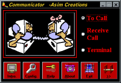



## Communicator  \-Asim Abbasi

### Description

A VB5 based project, created mainly for Apache Telephony Modems for eliminating some technical short comings in Window's Dialer and HyperTerminal.

Salient Features

The software has the following unique features

Dialer

Dialer with LED simulated acoustic click numeric keypad.

Address Book (AB) with Name, Phone and Notes field.

Search Engine and erasing of unwanted data are the qualities of AB.

Capable of shifting data from AB to Dialer.

Animated display of the workings/instructions of connection procedure.

Reception of incoming Calls

Easy to connect.

Vigilant.

Users can perform their work after activating it

It is smart enough to generate RING loops

It can display messages and error in phone call reception.

Since it can produce sound on call arrival so Users do not need to worry about the incoming call and can comfortably stick to their work.

Chat

Complete Chatting.

LED simulated screen.

Save Chatting.

Voice/Data Communication

Using the Chat Screen User can perform Voice/Data Communication.

Chat Window is capable of passing commands to attached Modem.

Users have to concern their Modem Reference Guide for V/D Commands.

Configuration

Using the Configuration window User can have control on following quantities.

Data Bits

Parity

Baud Rates

Communication Ports

Stop Bits

Handshaking

RThreshold

SThreshold

Input Buffer size

Output Buffer size

Tone Dialing

Pulse Dialing

Interface

Attractive

Self-explanatory

Windows Oriented

User Friendly

Disclaimer:

Download &amp; use this software at your own risk. If something wrong happens to your system or anyone else system connected to your computer, neither Takveen nor the author would not be responsible!!!
 
### More Info
 

             |
---                |---
**Submitted On**   |2000-10-11 13:25:58
**By**             |[Asim Abbasi](https://github.com/Planet-Source-Code/PSCIndex/blob/master/ByAuthor/asim-abbasi.md)
**Level**          |Advanced
**User Rating**    |4.7 (14 globes from 3 users)
**Compatibility**  |VB 5\.0, VB 6\.0
**Category**       |[Complete Applications](https://github.com/Planet-Source-Code/PSCIndex/blob/master/ByCategory/complete-applications__1-27.md)
**World**          |[Visual Basic](https://github.com/Planet-Source-Code/PSCIndex/blob/master/ByWorld/visual-basic.md)
**Archive File**   |[Communicat2010057312006\.zip](https://github.com/Planet-Source-Code/asim-abbasi-communicator-asim-abbasi__1-66144/archive/master.zip)

